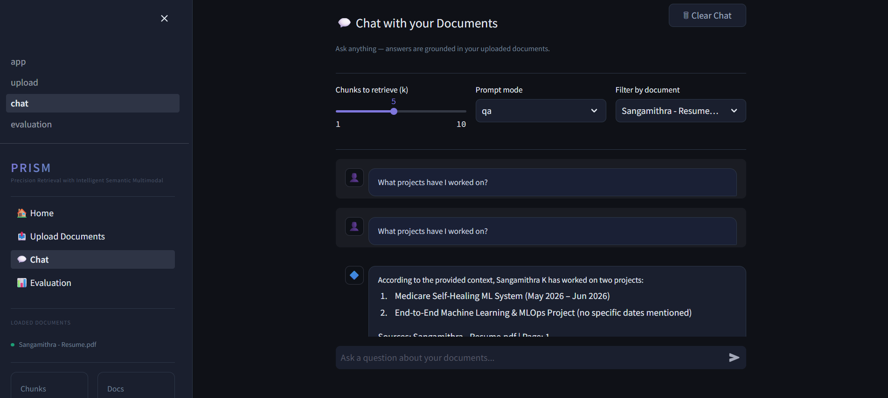

<div align="center">

# 🔷 PRISM
### Precision Retrieval with Intelligent Semantic Multimodal

[](https://github.com/Mithra0-dot/prism-rag/actions)
[](https://python.org)
[](https://fastapi.tiangolo.com)
[](https://langchain.com)
[](https://chromadb.com)
[](https://docker.com)
[](LICENSE)

**A production-grade Multimodal RAG engine that answers questions about your documents with source citations — powered by hybrid search, local LLMs, and computer vision.**

[Features](#features) • [Architecture](#architecture) • [Quickstart](#quickstart) • [API Docs](#api) • [Tech Stack](#tech-stack)

</div>

---

## What is PRISM?

PRISM is an enterprise-grade **Retrieval-Augmented Generation (RAG)** system that lets you upload any document and ask questions about it in natural language. Unlike basic RAG implementations, PRISM combines:

- **Hybrid Search** — BM25 keyword search + vector semantic search fused with Reciprocal Rank Fusion
- **Multimodal Ingestion** — extracts text from both written content AND embedded charts/images via OCR
- **Local LLM** — runs completely free using Ollama (llama3.2) with no API costs
- **Streaming Responses** — answers appear word-by-word via Server-Sent Events
- **Source Citations** — every answer links back to the exact page it came from

---

## Features

| Feature | Details |
|---|---|
| 📄 Document Ingestion | PDF, TXT, MD, DOCX with semantic chunking |
| 🔍 Hybrid Search | BM25 + ChromaDB vector search with RRF fusion |
| 🧠 Local LLM | Llama3.2 via Ollama — free, no API key needed |
| 👁️ Computer Vision | OpenCV + EasyOCR for chart/image text extraction |
| ⚡ Streaming | Token-by-token SSE streaming responses |
| 📎 Citations | Page-level source attribution on every answer |
| 📊 Evaluation | Ragas metrics dashboard + MLflow experiment tracking |
| 🐳 Docker | Multi-stage Dockerfile + docker-compose orchestration |
| ✅ CI/CD | GitHub Actions pipeline (lint + tests on every push) |

---
## Demo



## Architecture

```
┌─────────────────────────────────────────────────────────┐
│                    Streamlit Frontend                    │
│         Upload │ Chat (streaming) │ Evaluation          │
└────────────────────────┬────────────────────────────────┘
                         │ HTTP / SSE
┌────────────────────────▼────────────────────────────────┐
│                   FastAPI Backend                        │
│                                                          │
│  ┌─────────────┐    ┌──────────────┐    ┌────────────┐  │
│  │  Ingestion  │    │  Retrieval   │    │ Generation │  │
│  │             │    │              │    │            │  │
│  │ DocumentLoader   │ HybridSearch │    │ PRISMChain │  │
│  │ Chunker     │    │ BM25+Vector  │    │ Ollama LLM │  │
│  │ VisionOCR   │    │ RRF Fusion   │    │ Streaming  │  │
│  └──────┬──────┘    └──────┬───────┘    └────────────┘  │
│         │                  │                             │
│  ┌──────▼──────────────────▼───────────────────────┐    │
│  │              ChromaDB Vector Store               │    │
│  │         Persistent local vector database         │    │
│  └──────────────────────────────────────────────────┘    │
└─────────────────────────────────────────────────────────┘
                         │
┌────────────────────────▼────────────────────────────────┐
│                  Ollama (llama3.2)                       │
│              Local LLM — free, no API key               │
└─────────────────────────────────────────────────────────┘
```

---

## Quickstart

### Prerequisites
- Python 3.11
- [Ollama](https://ollama.com/download) installed and running
- Git

### 1. Clone the repo
```bash
git clone https://github.com/Mithra0-dot/prism-rag.git
cd prism-rag
```

### 2. Set up environment
```bash
python -m venv venv
venv\Scripts\activate          # Windows
# source venv/bin/activate     # Mac/Linux

pip install -r requirements.txt
cp .env.example .env
```

### 3. Pull the LLM
```bash
ollama pull llama3.2
```

### 4. Start the backend
```bash
python -m uvicorn backend.main:app --reload --port 8000
```

### 5. Start the frontend
```bash
streamlit run frontend/app.py
```

Open `http://localhost:8501` and start asking questions about your documents.

---

## Docker

```bash
# Build and run everything with one command
docker-compose up --build
```

Services:
- **prism-backend** → `http://localhost:8000`
- **ollama** → `http://localhost:11434`

---

## API

Full interactive docs available at `http://localhost:8000/api/v1/docs`

| Method | Endpoint | Description |
|---|---|---|
| `GET` | `/api/v1/health` | Health check |
| `POST` | `/api/v1/ingest/upload` | Upload and ingest a document |
| `GET` | `/api/v1/ingest/documents` | List all ingested documents |
| `DELETE` | `/api/v1/ingest/document/{id}` | Delete a document |
| `POST` | `/api/v1/query/ask` | Ask a question (full response) |
| `POST` | `/api/v1/query/stream` | Ask a question (SSE streaming) |
| `POST` | `/api/v1/query/search` | Raw hybrid search |

---

## Tech Stack

| Layer | Technology |
|---|---|
| Frontend | Streamlit |
| Backend | FastAPI + Uvicorn |
| RAG Framework | LangChain |
| Vector Store | ChromaDB |
| Embeddings | sentence-transformers/all-MiniLM-L6-v2 |
| Hybrid Search | rank-bm25 + ChromaDB (RRF fusion) |
| LLM | Ollama (llama3.2) |
| Computer Vision | OpenCV + EasyOCR |
| Evaluation | Ragas + MLflow |
| Containerisation | Docker + docker-compose |
| CI/CD | GitHub Actions |
| Language | Python 3.11 |

---

## Project Structure

```
prism-rag/
├── backend/
│   ├── main.py                    # FastAPI app entry point
│   ├── core/
│   │   ├── config.py              # Pydantic settings management
│   │   ├── logger.py              # Structured logging (Loguru)
│   │   └── exceptions.py          # Custom exception hierarchy
│   ├── api/routes/
│   │   ├── ingest.py              # Document ingestion endpoints
│   │   └── query.py               # RAG query endpoints
│   └── rag/
│       ├── ingestion/
│       │   ├── loader.py          # Multi-format document loader
│       │   ├── chunker.py         # Semantic chunking strategies
│       │   └── vision.py          # OpenCV + EasyOCR pipeline
│       ├── retrieval/
│       │   ├── embedder.py        # Sentence-transformers wrapper
│       │   ├── vector_store.py    # ChromaDB interface
│       │   └── hybrid_search.py   # BM25 + vector RRF fusion
│       └── generation/
│           ├── prompt.py          # Prompt templates
│           └── chain.py           # LangChain RAG chain
├── frontend/
│   ├── app.py                     # Streamlit entry point
│   └── pages/
│       ├── 01_upload.py           # Document upload UI
│       ├── 02_chat.py             # Streaming chat interface
│       └── 03_evaluation.py       # Ragas metrics dashboard
├── tests/
│   └── test_api.py                # 12 unit tests
├── Dockerfile                     # Multi-stage Docker build
├── docker-compose.yml             # Backend + Ollama orchestration
└── .github/workflows/ci.yml       # GitHub Actions CI
```

---

## Built By

**Sangamithra K** — BTech CSE (AIML), 3rd Year  
Built as a portfolio project demonstrating end-to-end ML systems engineering.

---

<div align="center">
⭐ Star this repo if you found it useful
</div>